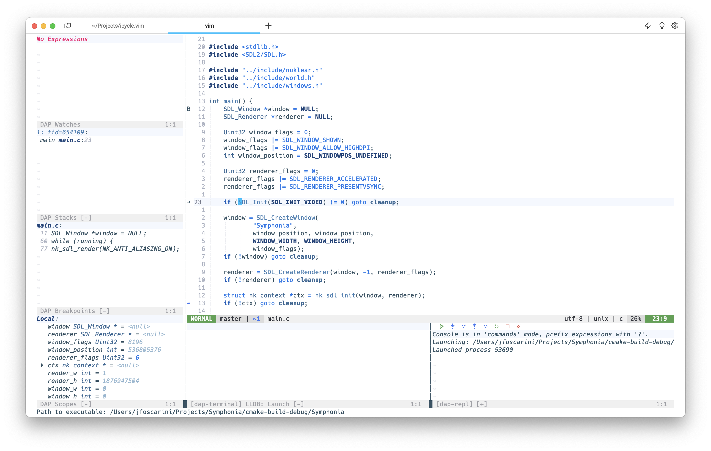

# Icycle.vim

White and blue (neo)vim colorscheme. It is currently under development and is subject to change drastically.



## Features
- support for [nvim-dap-ui](https://github.com/rcarriga/nvim-dap-ui) colors.

## Inspiration
- [IntelliJ](https://github.com/chiendo97/intellij.vim) (based on)
- [OneDark](https://github.com/navarasu/onedark.nvim)

## Installation & Usage
### Neovim

```lua
    {
        "jfoscarini/icycle.vim",
        config = function()
            vim.cmd.set("background=light")
            vim.cmd.colorscheme("icycle")
        end
    }
```

### Vim
```vim
    Plug 'jfoscarini/icycle.vim'
    set background=light
    colorscheme icycle
```

Note: you must enable true colors in (neo)vim.

